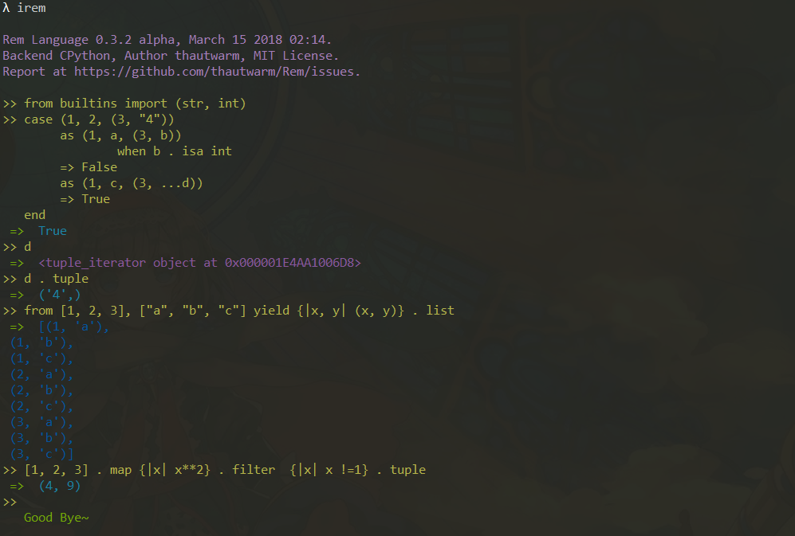

[](https://pypi.python.org/pypi/remlang)
[](https://github.com/thautwarm/Rem/blob/master/intro.md)
[](https://github.com/thautwarm/Rem/blob/master/LICENSE)


# Available Rem Langauge

Just use **PyPI**. Recommend to install `cytoolz` before installing to speed up function calls in Rem.

[](./overview.png)


## Some Support Features

See all features at [Inrtoduction](./intro.md).

- [Pattern Matching](https://github.com/thautwarm/Rem/blob/master/intro.md#pattern-matching)

    Currenly support `case` syntax.
    ```
    case expr 
        as destruction 
        [when condition]
        => statements
    end
    ```

    In the future this feature would be applied on arguments for multiple dispatch.

- [**Inverted Syntax**](https://github.com/thautwarm/Rem/blob/master/intro.md#inverted-syntax)(see the priority table in the linked page)

    ```
    file . open . write some_text
    ```
    
    `.` has a high priority while `then` has a lower one.


- [Into Statement](https://github.com/thautwarm/Rem/blob/master/intro.md#into-statement)(just like `goto`)
     


- [Currying Function](https://github.com/thautwarm/Rem/blob/master/intro.md#functionlambda)

- [Scope](https://github.com/thautwarm/Rem/blob/master/intro.md#scope)

- [Where Syntax and Block Expression](https://github.com/thautwarm/Rem/blob/master/intro.md#where-syntax)


- [For Comprehension](https://github.com/thautwarm/Rem/blob/master/intro.md#for-comprehension)


## 关于中文编程

Rem 支持中文编程来源于它的tokenizer可以被动态操控，在任意一个Rem模块里，均有一个`__token__`对象。当下内置了一个无参函数`中文编程`， 便可以使用中文关键字。

```
>> call 中文编程
>> 当 [3, 2] as [甲, 乙] => 甲 * 乙 end
=> 6
```

中英文token对照
```
{
    '然后': '`then`',
    '当': '`when`',
    '并且': '`and`',
    '或者': '`or`',
    '含于': '`in`',
    '非': '`not`',
    '对于': '`case`',
    '作为': '`as`',
    '结束': '`end`',
    '其中': '`where`',
    '从': '`from`',
    '生成': '`yield`',
    '跳跃到': '`into`',
    '使': '`let`',
    '让': '`let`',
    '真': '`True`',
    '假': '`False`',
    '空': '`None`',
    '导入': '`import`',
    '是': '`is`',
    '之': '.',
}
```

用事实证明中文编程的反人类。

    

